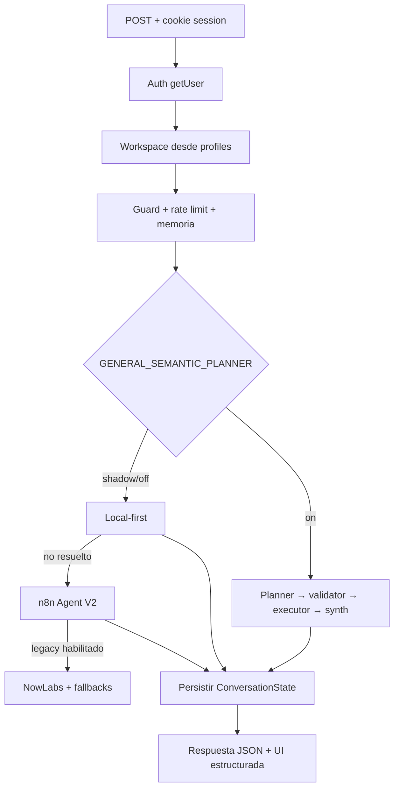

# W3 — Arquitectura real de IA, agentes e integraciones

Estado: auditado en código · 2026-09-25

Owner: W3

Base inspeccionada: `general-semantic-planner` @ `6ea06e4`

Rama de trabajo: `w3/assistant-runtime-foundation`

## Conclusión ejecutiva

La dirección del planner general es correcta, pero el runtime actual mantiene tres cerebros solapados: local-first/legacy, n8n Agent V2 y General Semantic Planner. El planner ya cumple la separación LLM → plan → validación → reader, pero todavía hereda una ontología inmobiliaria y sus writes solo generan preview. La vía de escritura P65/P70 sí implementa el control plane correcto, aunque convive con `/api/assistant/confirm`, una ruta legacy distinta.

Este ciclo corrige un defecto real de continuidad: el puente del planner leía `type/label`, mientras `ConversationState` guarda `entityType/displayLabel`; además, el modo ON no persistía el estado producido por el planner. Ahora ambos motores comparten referencias, última lista y foco sin enviar UUIDs al modelo ni guardar datos de negocio.

## Flujo real de `/api/assistant/v2`

### Secuencia verificada

1. `buildSupabase()` crea cliente cookie-bound con publishable/anon key.
2. `supabase.auth.getUser()` resuelve al actor; el body nunca decide usuario.
3. `profiles.workspace_id` resuelve el tenant. RLS sigue siendo la última barrera.
4. El body aporta mensaje/hilo y contexto compatible con versiones anteriores; no es autoridad para identidad o workspace.
5. Crisis guard, rate limit e input guard se ejecutan antes del cerebro.
6. Se cargan memoria de entidad, últimos mensajes del hilo y `ConversationState` versionado.
7. Los botones de confirm/cancel envían solo `actionId`; el servidor relee `assistant_actions`.
8. Planner:
   - `off`: no interviene.
   - `shadow`: ejecuta lecturas/previews y solo emite observabilidad.
   - `on`: interpreta, valida, ejecuta capabilities, sintetiza con evidencia y responde sin fallback semántico silencioso.
9. Fuera de ON, `tryLocalAnswer` intercepta consultas inequívocas; si no, se firma una turn policy y se llama a n8n Agent V2.
10. El provider legacy solo entra si está explícitamente habilitado/seleccionado.
11. Se persisten referencias conversacionales; no se persisten snapshots como verdad.
12. La respuesta expone texto de fallback y puede incluir UI estructurada validada.

## Capas y decisión

| Capa | Código principal | Decisión |
|---|---|---|
| Route/auth/tenant | `src/app/api/assistant/v2/route.ts` | Conservar; dividir más adelante por responsabilidad. Revisar con W4 la resolución de workspace por perfil. |
| Planner semántico | `src/lib/agents/planner/*` | Conservar y convertir en cerebro primario tras evals/shadow. |
| Plan contract | `plan-contract.ts` | Conservar; ya bloquea workspace, SQL, HTTP, IDs del modelo e inputs sospechosos. |
| Capability executor | `capability-executor.ts` | Conservar; adaptar a contratos telecom publicados por W1. |
| Capability catalog | `capability-ontology.ts` + `capability-contracts.ts` | Ontología actual es inmobiliaria; el contrato estable nuevo añade schemas, auth, tenant, riesgo, confirmación, idempotencia y errores. |
| Conversation memory | `conversation-state.ts` + puente del planner | Conservar como memoria única de referencias; nunca como fuente de datos. |
| Local-first/detectores | `local-answers.ts` y detectores | Mantener solo como fast paths deterministas medidos; no ampliar regex como semántica principal. |
| n8n Agent V2 | `n8n-assistant-client.ts` + workflows versionados | Mantener temporalmente y para integraciones/automatizaciones; retirar como cerebro primario después de paridad demostrada. |
| Provider legacy | `nowlabs-main-agent.ts`, fallbacks | Congelar; instrumentar uso y retirar por etapas. |
| Writes modernos | `/api/agent/action`, action registry/policy | Conservar como control plane: prepare → confirm → execute → verify. |
| Writes legacy | `/api/assistant/confirm` | Migrar consumidores y retirar; acepta un contrato alternativo y publica acciones no presentes en el registry moderno. |
| UI contract | `src/lib/assistant/ui-contract.ts` | Conservar; ampliado con entity refs, tablas, follow-ups y navegación. |

## Capability contract v1

`src/lib/agents/planner/capability-contracts.ts` deriva un contrato por cada capability publicada. No duplica tablas ni acciones. Cada entrada define:

- nombre y descripción;
- input cerrado, entidad, temporalidad y mutation fields;
- output estructurado y taxonomía de estados;
- autenticación y capas de enforcement;
- tenant server-resolved, nunca elegido por el modelo;
- `READ`, `SAFE_WRITE` o `SENSITIVE_WRITE`;
- política de confirmación e idempotencia;
- handler real y error contract seguro.

No existe ninguna capability `IRREVERSIBLE` publicada. Los writes actuales son `SAFE_WRITE` o `SENSITIVE_WRITE`, siempre `preview_confirm` e idempotentes. El planner solo produce preview; la ejecución corresponde al action control plane.

## Respuesta estructurada para W2

El contrato de `AssistantUiPayload` soporta, además del texto:

- referencias de entidad (`entityType`, `entityId`, `label`, `subtitle`);
- tablas con columnas tipadas y flag de truncado;
- action/automation/finding cards existentes;
- follow-up actions con prompt explícito;
- navigation targets por módulo/entidad.

La validación runtime limita tamaños y rechaza bloques con claves de token/secret. El texto sigue siendo fallback obligatorio; W2 no debe parsear Markdown para construir controles.

## Integraciones auditadas

| Integración | Estado observado | Acción W3 |
|---|---|---|
| OpenAI | Planner por REST con structured output no estricto + validación propia; modelos configurables por env. | Medir capability/args/groundedness/latencia/coste antes de cambiar modelos. |
| n8n | Agent V2 y múltiples workflows/versiones; tool/action endpoints server-to-server. | Reducirlo a automatización, webhooks y conectores una vez estabilizado el core. Mantener exports versionados. |
| Google Calendar | OAuth, import, sync y CRUD presentes; webhook realtime es un skeleton con TODO explícito. | No declarar realtime listo. Completar watch renewal, channel lookup e incremental sync antes de activar. |
| WhatsApp/Meta | Status/test/webhook y persistencia inbound presentes; depende de credenciales y mapping de conexión. | Mantener scope; validar E2E y aislamiento antes de ampliar. |

## Estrategia de modelos y coste

No se fija un modelo por marca. El router debe seleccionar por clase de trabajo usando el benchmark real:

| Clase | Ruta candidata | Gate |
|---|---|---|
| Pregunta simple / capability obvia | modelo económico con structured output | exactitud de capability y argumentos no inferior al umbral acordado |
| Plan multi-goal, ambigüedad, follow-up | modelo de planner más capaz | entity accuracy, clarification quality y groundedness |
| Resumen masivo | modelo con contexto adecuado sobre evidencia ya recuperada | cobertura + coste/tokens + latencia |
| Fallo de proveedor | modelo secundario configurado por operador | sin fallback a regex/legacy que oculte el fallo |

Primero se establece baseline; después se optimiza coste. Las métricas mínimas son capability, argumentos, entidad, groundedness, éxito de acción, alucinación, latencia, tokens y coste.

## Baseline de este ciclo

| Check | Resultado |
|---|---|
| TypeScript `npx tsc --noEmit` | PASS |
| Evals puras heredadas: security, permissions, adversarial, turn policy, root/n8n contract, reliability, conversation | PASS |
| Capability contract eval | PASS |
| Planner/ConversationState bridge eval | PASS |
| UI structured contract eval | PASS |
| Benchmark con datos Supabase | BLOQUEADO localmente: faltan variables/entorno, no se simula resultado |

La suite siguiente debe añadir corpus telecom cuando W1 publique entidades y campos canónicos: permanencias, renovaciones, líneas, comercial asignado y oportunidades de seguimiento. Hasta entonces no se inventan readers ni tablas.

## Riesgos abiertos

1. La ontología y los prompts todavía dicen “inmobiliario”; no sirven como contrato final telecom.
2. Conviven dos planos de escritura con semánticas diferentes.
3. La route concentra demasiadas responsabilidades y el frontend del asistente conserva flujo legacy de `preparedAction`.
4. El planner genera preview, pero todavía no crea una acción P65 persistida desde su resultado.
5. El workspace se obtiene de un único `profiles.workspace_id`; W4/W1 deben confirmar el modelo final de membership/selección.
6. Los evals live requieren configuración segura de staging; no deben apuntar a producción.

## Próxima secuencia W3

1. Consumir `DATA_MODEL`/handoff W1 y publicar capabilities telecom sin migraciones inventadas.
2. Crear dataset de eval telecom y baseline por modelo.
3. Adaptar output del planner al action control plane y UI contract.
4. Ejecutar shadow con tráfico de staging, comparar con P71/n8n y fijar gates.
5. Migrar el frontend fuera de `/api/assistant/confirm`.
6. Retirar capas legacy solo con telemetría de uso, tests y plan de rollback.
