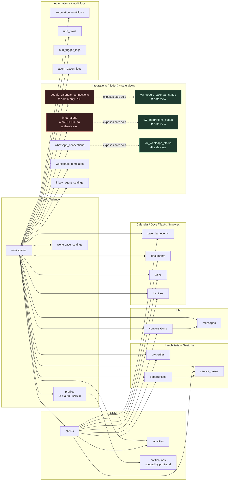

# CostaDelSolRealHomesCRM — Schema Map

> Live map of the Supabase database. Companion to
> [`costadelsol_schema_v1.sql`](./costadelsol_schema_v1.sql). When the SQL
> file changes, this map changes too — they must stay in sync.

## Quick reference

| Field | Value |
|---|---|
| Supabase org | NowLabs (`foydtwmeibmyebeogecz`) |
| Project | `costadelsol-crm` |
| Project ref | `ktsgfukjgldeylfzrayr` |
| Region | `eu-central-1` |
| Postgres | 17 |
| Business tables | **24** |
| Safe views | **3** (`vw_google_calendar_status`, `vw_whatsapp_status`, `vw_integrations_status`) |
| Helpers | **5** (4 SECURITY DEFINER + 1 INVOKER) |
| RLS / FORCE RLS | enabled on 24/24 tables |
| Policies | 99 (4 per table, 7 on `profiles`) |
| Seed workspace | `costadelsol` |
| Auth users today | 0 (provisioning is service_role-only until invite flow lands) |

## Table groups

The 24 tables fall into eight thematic groups. The split mirrors how the
Next.js app organises its query helpers (`src/lib/*.ts`).

### 1. Core / Tenancy
The multi-tenant foundation. Everything else FKs back to `workspaces`.

- **`workspaces`** — one row per customer tenant. Identified by `slug`.
- **`profiles`** — one row per `auth.users` user, joined by `id`. Holds
  the workspace membership and the role (`nowlabs_admin` / `client_admin`
  / `member`). INSERT is service_role-only; UPDATE is column-scoped to
  email/full_name/metadata/updated_at for the user themselves.
- **`workspace_settings`** — single-row-per-workspace preferences
  (vertical, language, timezone, AI tone, auto-reply gate).

### 2. CRM
The customer / sales backbone shared by every vertical pack.

- **`clients`** — customers and leads. Channel, status, lead score.
- **`activities`** — append-only timeline. Written by the UI, the
  vertical helpers (`vertical-queries.ts`) and the WhatsApp inbound
  processor. Members can INSERT; UPDATE/DELETE are nowlabs_admin only.
- **`notifications`** — per-user notifications scoped by `profile_id`
  (NOT by workspace). Each user only sees their own.

### 3. Inmobiliaria (real estate)
Vertical pack: real-estate listings.

- **`properties`** — listings managed by the operator. Linked to a
  client when the property has an owner / interested party in the CRM.

### 4. Gestoría / Extranjería
Vertical pack: case-file management.

- **`opportunities`** — sales pipeline entries (one client can have
  several). Vertical, pipeline, stage, value, probability, source,
  assignee, expected close date.
- **`service_cases`** — gestoría / immigration case files. Linked to a
  client and (optionally) the opportunity that triggered the case.

### 5. Inbox
WhatsApp + email + web chat threads handled by the operator.

- **`conversations`** — one thread per channel × client. The `metadata`
  jsonb holds runtime detail (phone, externalConversationId, assistant
  mode). GIN index on metadata so the WhatsApp inbound processor can do
  `.contains({phone: …})`.
- **`messages`** — one row per inbound or outbound message. Idempotent
  on `(workspace_id, external_message_id)` for webhook re-deliveries.

### 6. Calendar / Documentos / Facturación
Operational tables used across verticals.

- **`calendar_events`** — workspace-level agenda. Carries both the
  canonical `start_at` / `end_at` and the legacy `date` / `start_hour`
  / `start_minute` / `duration` so the existing code keeps working.
  Linked to Google Calendar via `google_event_id` + `google_calendar_id`.
- **`documents`** — pointers to files stored in Supabase Storage
  (buckets are NOT auto-created by this migration).
- **`tasks`** — internal to-do items, optionally linked to a client.
- **`invoices`** — billing records. Keeps both `invoice_number` and
  `number`, both `concept` and `plan`, because the existing app writes
  both shapes.

### 7. Integraciones
Provider bindings + Inbox-agent config + templates.

- **`integrations`** — generic provider catalog (status, name, config).
  **Not directly readable by the frontend** — see [Hidden tables](#hidden-tables-do-not-read-from-frontend).
- **`whatsapp_connections`** — Meta WhatsApp Cloud API binding. Public
  ids and webhook URL only; no access tokens today.
- **`google_calendar_connections`** — Google Calendar binding. Holds
  `refresh_token_enc` (currently plaintext, encryption pending).
  **Not directly readable by the frontend.**
- **`workspace_templates`** — operator-editable message / proposal /
  document_request templates.
- **`inbox_agent_settings`** — single-row-per-workspace runtime config
  for the WhatsApp / NowLabs agent (tone, business context, auto-reply
  toggle).

### 8. Automatizaciones / Logs
n8n flow registry + audit trails.

- **`automation_workflows`** — workspace-level catalog of automations
  the operator has enabled in-app.
- **`n8n_flows`** — per-workspace registry of n8n flows. Holds only the
  public webhook URL; the n8n secret stays in env vars.
- **`n8n_trigger_logs`** — append-only audit of every n8n trigger.
  Members can INSERT; SELECT is admin-only.
- **`agent_action_logs`** — append-only audit of every action the
  NowLabs AI agent takes in the workspace. Same RLS as `n8n_trigger_logs`.

## Diagram

The diagram below is left-to-right so it stays wide and scannable
instead of one tall column. Each box is a table; lines show the foreign
keys that matter for query planning. Notification / audit-only edges
(`profile_id`, `created_by`, `assigned_to`) are omitted for clarity.

Read the diagram as: every coloured edge starts at the parent (`workspaces`,
`clients`, `conversations`, …) and ends at the child table. The dashed
lines are not foreign keys — they show which safe view projects which
hidden table.

## Summary table

Columns:
- **Lee** — who can run `SELECT` on the row set (RLS-filtered).
- **Escribe** — who can write (RLS- and column-grant-filtered).
- **Notes** — anything non-obvious.

| Tabla | Para qué sirve | FK principales | Lee | Escribe |
|---|---|---|---|---|
| `workspaces` | Tenant raíz | — | miembros del workspace, nowlabs_admin | `client_admin` (campos básicos), `nowlabs_admin` (todo) |
| `profiles` | Usuario por workspace | `id`→`auth.users.id`, `workspace_id` | self, admin del workspace, nowlabs_admin | self (email/full_name/metadata/updated_at), service_role (todo lo demás) |
| `workspace_settings` | Preferencias del workspace | `workspace_id` | miembros | miembros (INSERT/UPDATE), nowlabs_admin (DELETE) |
| `clients` | Clientes y leads | `workspace_id` | miembros | miembros (CRUD), admin (DELETE) |
| `properties` | Listados inmobiliarios | `workspace_id`, `client_id?` | miembros | miembros (CRUD), admin (DELETE) |
| `opportunities` | Pipeline comercial | `workspace_id`, `client_id?`, `assigned_to?` | miembros | miembros (CRUD), admin (DELETE) |
| `service_cases` | Expedientes gestoría/extranjería | `workspace_id`, `client_id?`, `opportunity_id?`, `assigned_to?` | miembros | miembros (CRUD), admin (DELETE) |
| `conversations` | Threads Inbox | `workspace_id`, `client_id?` | miembros | miembros (CRUD), admin (DELETE) |
| `messages` | Mensajes Inbox | `workspace_id`, `conversation_id` | miembros | miembros (CRUD), admin (DELETE) |
| `calendar_events` | Citas / visitas | `workspace_id`, `client_id?`, `assigned_to?` | miembros | miembros (CRUD), admin (DELETE) |
| `documents` | Punteros a Storage | `workspace_id`, `client_id?`, `created_by?` | miembros | miembros (INSERT/UPDATE), admin (DELETE) |
| `tasks` | To-do interno | `workspace_id`, `client_id?`, `assigned_to?` | miembros | miembros (CRUD), admin (DELETE) |
| `invoices` | Facturación | `workspace_id`, `client_id?` | miembros | miembros (INSERT/UPDATE), admin (DELETE) |
| `activities` | Timeline | `workspace_id`, `client_id?` | miembros | miembros (INSERT), nowlabs_admin (UPDATE/DELETE) |
| `notifications` | Avisos por usuario | `profile_id`, `workspace_id?` | self, nowlabs_admin | self (CRUD) |
| `integrations` 🔒 | Proveedores conectados | `workspace_id` | **vía `vw_integrations_status`**; admin/server con service_role para `config` | admin (INSERT/UPDATE/DELETE) |
| `whatsapp_connections` | Binding WhatsApp Cloud | `workspace_id` | miembros | admin (CRUD) |
| `google_calendar_connections` 🔒 | Binding Google Calendar | `workspace_id` | **vía `vw_google_calendar_status`**; service_role para tokens | admin (INSERT/UPDATE/DELETE) |
| `workspace_templates` | Plantillas editables | `workspace_id` | miembros | miembros (INSERT/UPDATE), admin (DELETE) |
| `inbox_agent_settings` | Config agente IA Inbox | `workspace_id` | miembros | admin (INSERT/UPDATE), nowlabs_admin (DELETE) |
| `automation_workflows` | Catálogo automations | `workspace_id` | miembros | admin (CRUD) |
| `n8n_flows` | Registry n8n por workspace | `workspace_id` | miembros | admin (CRUD) |
| `n8n_trigger_logs` | Audit n8n | `workspace_id` | admin | miembros (INSERT), nowlabs_admin (UPDATE/DELETE) |
| `agent_action_logs` | Audit agente IA | `workspace_id` | admin | miembros (INSERT), nowlabs_admin (UPDATE/DELETE) |

`miembros` = cualquier `profiles` con `workspace_id` igual al de la fila.
`admin` = `client_admin` del mismo workspace OR `nowlabs_admin`.
`service_role` siempre bypasea RLS y todos los grants.

## Hidden tables (do NOT read from frontend)

These tables hold secrets or potentially-sensitive provider config. The
RLS is admin-only and the SELECT grant for `authenticated` has been
revoked entirely — the only paths in are (a) one of the safe views, or
(b) a server route using `SUPABASE_SERVICE_ROLE_KEY`.

| Tabla | Por qué | Reemplazo seguro |
|---|---|---|
| `google_calendar_connections` | Guarda `refresh_token_enc` (OAuth refresh token, hoy en plano), `webhook_channel_id`, `webhook_resource_id`, `incremental_sync_tokens`. Una lectura columna-a-columna fugaría credenciales aunque RLS limite filas. | `vw_google_calendar_status` (boolean `has_refresh_token`, sin tokens) o service_role server-side. |
| `integrations` | `config` jsonb puede llegar a guardar webhook secrets / API keys según evolucione el catálogo. | `vw_integrations_status` (id, workspace_id, provider, name, status, timestamps) o service_role server-side. |
| `whatsapp_connections` | Hoy NO guarda tokens (Meta tokens viven en env vars), pero la lista de columnas crece. Misma política preventiva. | `vw_whatsapp_status` (lista fija de columnas públicas). |

> Si alguna ruta Next.js hoy lee estas tablas con la sesión de usuario,
> hay que migrarla a la view correspondiente o a una server route con
> `SUPABASE_SERVICE_ROLE_KEY`. Detalle exacto por ruta en el bloque
> `TODO_CODE_FOLLOWUP` al final de
> [`costadelsol_schema_v1.sql`](./costadelsol_schema_v1.sql).

## Safe views

Tres views proyectan un subconjunto seguro de las tablas ocultas. Todas:
- corren como `postgres` (security_invoker = false en Google/Integrations,
  invoker = true en WhatsApp porque su base sí tiene SELECT para miembros);
- filtran por `current_workspace_id() OR is_nowlabs_admin()` en `WHERE`;
- omiten cualquier columna marcada como secreta;
- tienen `comment on view` explícito documentando el propósito;
- tienen `revoke all from public/anon` y `grant select to authenticated`.

| Vista | Sustituye a | Columnas expuestas |
|---|---|---|
| `vw_google_calendar_status` | `google_calendar_connections` | id, workspace_id, status, calendar_id, default_calendar_id, selected_calendar_ids, calendar_metadata, sync_enabled, last_sync_at, token_expiry, **has_refresh_token (boolean)**, webhook_expires_at, created_at, updated_at |
| `vw_integrations_status` | `integrations` | id, workspace_id, provider, name, status, created_at, updated_at |
| `vw_whatsapp_status` | `whatsapp_connections` | id, workspace_id, provider, phone_number, phone_number_id, whatsapp_business_account_id, meta_business_id, connection_status, webhook_url, sync_enabled, last_webhook_at, last_test_at, created_at, updated_at |

`has_refresh_token` y `token_expiry` no son secretos: el primero es un
boolean derivado, el segundo es un timestamp (cuándo expira el access
token; el access token jamás se guarda). Ambos son la excepción explícita
en la verification 16 del SQL.

## How the AI assistant reads the DB

The assistant (Inbox agent + Copilot) **never** reads Supabase from the
browser with the user cookie. Every read goes through a backend tool
that:

1. **Authenticates the session** and resolves the calling
   `auth.uid()` → `profiles.workspace_id`. The tool refuses to operate
   without a workspace.
2. **Scopes every query by `workspace_id`.** No tool ever runs a query
   without an explicit `.eq('workspace_id', workspaceId)` filter.
3. **Uses safe paths only:**
   - Reads of `integrations` / `google_calendar_connections` go through
     `vw_integrations_status` / `vw_google_calendar_status`. Never the
     base table.
   - Reads that need the refresh token (sync, import-events, disconnect)
     use `SUPABASE_SERVICE_ROLE_KEY` on the server, **only after**
     verifying the cookie session and workspace match.
4. **Caps results.** Every list tool has a hard limit (typically 20–50
   rows) to bound LLM context size and prevent enumeration.
5. **Never returns secrets to the model.** The backend strips any field
   whose name matches `refresh_token*`, `*_secret`, `*_key`, `config`,
   `credential*` before serialising the tool output. Source of truth:
   [`src/lib/assistant-tools.ts`](../../src/lib/assistant-tools.ts) (read path) +
   the integration routes under
   [`src/app/api/integrations/`](../../src/app/api/integrations/) (token paths).
6. **Writes are gated.** When the assistant proposes a write (book an
   event, create an invoice, send a reply) it returns a *prepared
   action* card; the human confirms in the UI before the write fires.
   Server-side writes still go through RLS / column grants — the AI
   does not have a privileged path of its own.

Tables/views the assistant is currently allowed to read (server-side,
workspace-scoped, no secrets):

- `clients`, `properties`, `opportunities`, `service_cases`
- `documents`, `calendar_events`, `conversations`, `messages`
- `tasks`, `invoices`, `activities`
- `workspace_settings`, `workspace_templates`, `inbox_agent_settings`
- `vw_integrations_status`, `vw_google_calendar_status`, `vw_whatsapp_status`

Tables/columns the assistant **must not** read:

- `google_calendar_connections.refresh_token_enc`,
  `webhook_channel_id`, `webhook_resource_id`, `incremental_sync_tokens`
- `integrations.config`, `integrations.metadata`
- Any future `whatsapp_connections` column whose name matches a secret
  pattern
- `auth.users.*` (the assistant only needs `auth.uid()` from the request,
  resolved server-side; raw user rows are off-limits)

## How the file maps to the SQL

| Sección de esta guía | Bloques del SQL |
|---|---|
| Core / Tenancy | BLOQUE 02 |
| CRM | BLOQUE 03 + parts of 05 |
| Inmobiliaria + Gestoría | BLOQUE 03 |
| Inbox | BLOQUE 04 |
| Calendar / Docs / Tasks / Invoices | BLOQUE 05 |
| Integraciones | BLOQUE 06 |
| Automatizaciones + Logs | BLOQUE 06 |
| RLS + column grants | BLOQUE 08 (a/b) |
| Hardening de `anon` | BLOQUE 08c |
| Safe views | BLOQUE 09 |
| Seeds mínimos | BLOQUE 10 |
| Verifications | BLOQUE 11 |

## Maintenance rules

- Any change to a table (new column, renamed column, new FK) **must**
  update this file in the same PR. The two files share an audit trail.
- Adding a new table goes in the right group section + the summary table
  + the diagram + the AI assistant read-allow list (if applicable).
- Adding a new column to a "hidden" table (`integrations`,
  `google_calendar_connections`, `whatsapp_connections`) requires
  re-checking whether the safe view should expose it. Default = NO; opt
  in explicitly with a one-line justification.
